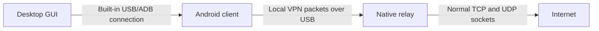

# RevBridge

[](https://github.com/Innocent254/revbridge/actions/workflows/ci.yml)
[](LICENSE)
[](#project-status)

**A modern desktop GUI for sharing a computer's internet connection with Android over USB—without root.**

RevBridge is a maintained derivative of [Genymobile's gnirehtet](https://github.com/Genymobile/gnirehtet). It adds a guided desktop app, current Android build support, automatic device checks, readable diagnostics, and reproducible releases for Windows, Linux, and macOS.

> [!IMPORTANT]
> RevBridge is an independent open-source project. It is not affiliated with or endorsed by Genymobile.

## Why this project exists

The original gnirehtet repository states that it is no longer actively maintained. Its last release used a 2019 Android build chain, targeted Android 10, had no desktop UI, and can be blocked on some current Android/OEM builds by the old `WRITE_SECURE_SETTINGS` activity permission.

RevBridge keeps the proven relay design while bringing the surrounding experience up to date:

| Area | RevBridge |
| --- | --- |
| Desktop control | Native-feeling GUI with phone selection and one-click connect/disconnect |
| Android compatibility | Android 5.0+ client built against Android 17 / API 37 |
| Newer-device launch fix | Removes the obsolete ADB-shell `WRITE_SECURE_SETTINGS` gate |
| Foreground service | Android 14+ VPN service type and notification requirements |
| Troubleshooting | Explains USB-driver, authorization, install, and occupied-port problems in plain language |
| Reconnection | Restores the reverse mapping after a brief USB disconnect |
| Releases | GitHub Actions packages the client, native relay, and desktop installers |
| Privacy | No account, analytics, proxy server, or RevBridge cloud service |

## How it works



The Android companion creates a local `VpnService` interface. IPv4 packets travel over an ADB reverse socket to the native Rust relay on the computer. The relay opens ordinary TCP and UDP connections on the phone's behalf.

## Quick start

1. Download the installer for your computer from [Releases](https://github.com/Innocent254/revbridge/releases).
2. Install and open RevBridge.
3. On the phone, enable **Developer options** and **USB debugging**.
4. Connect the unlocked phone with a data-capable USB cable. Its device name appears automatically.
5. Click **Connect**.
6. The first time only, accept Android's **Allow USB debugging?** and VPN permission prompts.

RevBridge installs its small Android companion automatically. No root access, separate Android app download, or Android SDK Platform Tools installation is required.

### Xiaomi, Redmi, Poco, Oppo, Realme, and similar OEMs

Some manufacturers add extra USB security controls. If companion installation or launch is blocked, open Developer options and enable the applicable options:

- **Install via USB**
- **USB debugging (Security settings)**
- **Disable permission monitoring** (wording varies by OEM)

RevBridge reports the relevant action when ADB returns a known restriction error. See [Troubleshooting](docs/TROUBLESHOOTING.md) for complete steps.

## Features

- Built-in direct USB connection; Google ADB/Platform Tools are not bundled or required
- Automatic device-name display, with a selector only when multiple phones are attached
- Automatic companion-client install and version checks
- One-click connect, disconnect, and live status
- Human-readable failure messages plus exportable technical logs
- Custom DNS servers, IPv4 routes, and relay port
- Automatic reconnection after a brief cable disconnect
- System light/dark theme and keyboard-accessible controls
- Strict Electron isolation: no Node.js access in the renderer and no unrestricted external navigation

## Project status

RevBridge is currently **alpha software**. The desktop UI and control logic have automated tests, and GitHub CI builds all three components. Hardware/OEM behavior still needs broad validation across Android versions and manufacturers before a stable `1.0` release.

Known inherited limitations:

- IPv4 only; IPv6 is not relayed.
- Android sees the connection as a VPN, so another VPN cannot be active simultaneously.
- Apps that insist on a physical Wi-Fi network may behave differently.
- USB debugging must remain enabled and authorized while the tunnel is active.

Please attach an exported RevBridge log and basic device details when [reporting a bug](https://github.com/Innocent254/revbridge/issues/new/choose). Logs contain relay events and ADB errors, not browsing payloads.

## Build from source

Prerequisites:

- Node.js 24 and npm
- Rust stable toolchain
- JDK 17
- Android SDK Platform 37 and Build Tools 36.0.0

```bash
# Desktop checks
cd desktop
npm ci
npm test
npm run typecheck
npm run build

# Native relay
cd ../relay-rust
cargo test --locked
cargo build --release --locked

# Android companion
cd ..
./gradlew :app:testDebugUnitTest :app:lintDebug :app:assembleDebug
```

Packaging and signing instructions are in [DEVELOP.md](DEVELOP.md) and [docs/RELEASING.md](docs/RELEASING.md).

## Repository layout

```text
app/          Android VPN companion
desktop/      Electron + TypeScript desktop GUI
relay-rust/   Native packet relay derived from gnirehtet
docs/         Architecture, troubleshooting, and release guides
.github/      CI, release automation, and dependency updates
```

## Security and privacy

Traffic is relayed locally through the computer. RevBridge does not decrypt TLS, inspect application payloads, send analytics, or operate an intermediary server. The Android VPN permission remains controlled by Android's system confirmation dialog.

See [SECURITY.md](SECURITY.md) for vulnerability reporting.

## Credits and licence

RevBridge is derived from **gnirehtet**, Copyright © 2017 Genymobile, originally authored by Romain Vimont and contributors. RevBridge modifications are Copyright © 2026 Innocent Cheng'ole Were and contributors.

The project is licensed under the [Apache License 2.0](LICENSE). Modified files retain upstream notices where applicable; project-level attribution is recorded in [NOTICE](NOTICE), and bundled dependency licenses are in [THIRD_PARTY_NOTICES.md](THIRD_PARTY_NOTICES.md).
