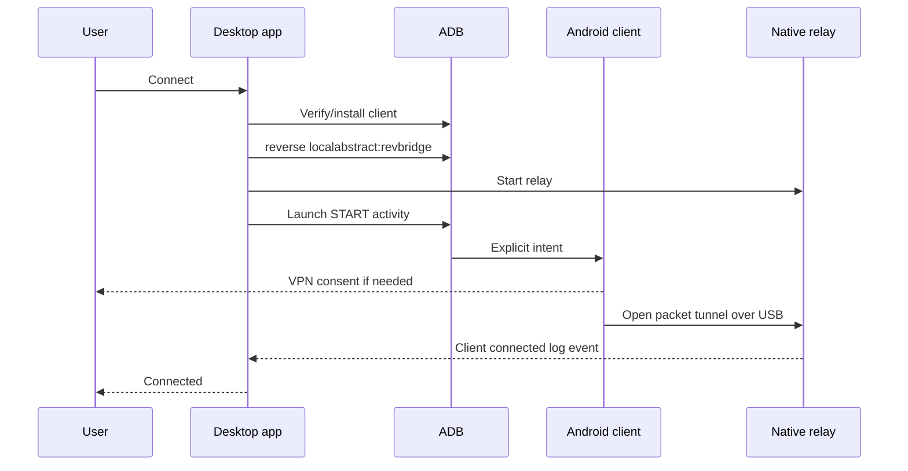

# Architecture

RevBridge preserves gnirehtet's packet protocol and wraps it with a safer, observable control plane.

## Components

### Desktop app

The Electron main process owns all privileged work:

- locating and executing ADB;
- enumerating authorized, unauthorized, and offline devices;
- installing/version-checking the companion APK;
- creating and removing the ADB reverse socket;
- starting, monitoring, and stopping the native relay; and
- storing local settings and exporting logs.

The renderer is a static Vite bundle. `contextIsolation`, the renderer sandbox, and disabled Node.js integration prevent UI content from accessing process or filesystem APIs. The preload bridge exposes only typed RevBridge operations.

### Android companion

The companion uses `VpnService.Builder` to create an IPv4 interface at `10.0.0.2`. It reads packets from the VPN file descriptor and sends them through the local abstract socket named `revbridge`. Android's ADB reverse mapping connects that socket to the relay's TCP port on the computer.

The exported transparent control activity accepts only the project's explicit start and stop actions. Android still requires system VPN consent before the service can establish the interface. The service itself is not exported.

### Native relay

The Rust relay accepts encapsulated IPv4 packets and maps them to normal TCP and UDP sockets. It synthesizes response packets and sends them back to the Android client. The packet engine intentionally remains close to upstream gnirehtet 2.5.1 while modernization work is tested incrementally.

## Connection sequence

## Trust and privacy model

- ADB authorization is controlled by Android's debugging-fingerprint prompt.
- VPN authorization is controlled by Android's system VPN prompt.
- No payload is sent to a RevBridge service because no such service exists.
- Relay logs can reveal destination IP addresses and should be reviewed before sharing.
- RevBridge does not add transport encryption to ordinary non-TLS internet traffic.
